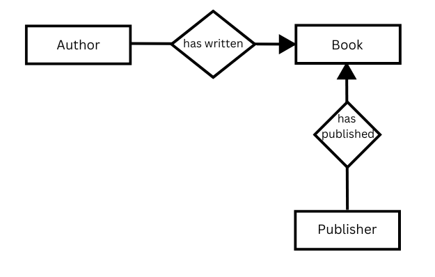
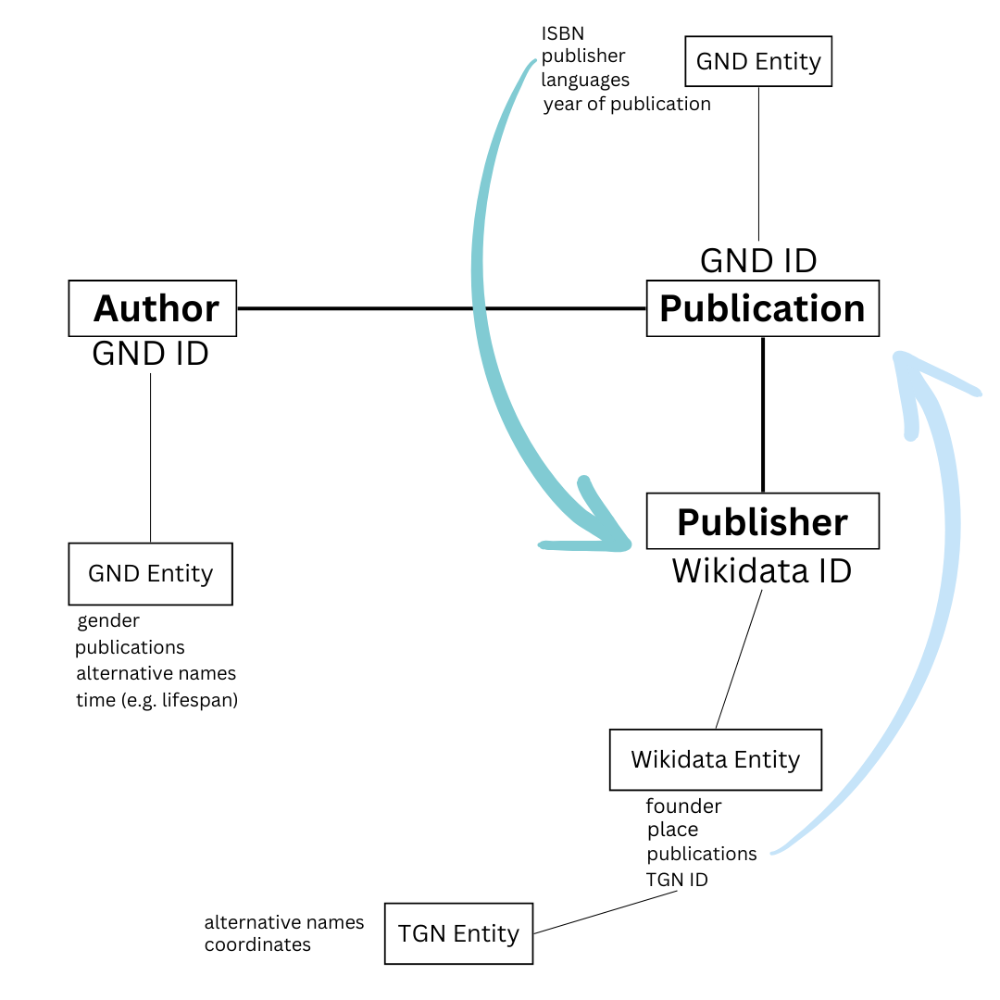

::: questions 

- What is a metadata standard?
- What is a metadata schema?
- What is a model?

:::

::: objectives

- Knowledge of the terms metadata standard and metadata schema. 
- Familiar with the basic ideas of standards and schemas.
- Familiar with the basic concepts and data relationships for standards and schemas.  
:::

## Standard, Schema or Model?

The terms *metadata standard*, *metadata schema*, and *metadata model* are often used synonymously. 
The following is an attempt to differentiate between the terms *metadata standard*, *metadata schema* and *model*. 
However, it must be emphasized that this is not a universal claim; rather, it is intended to facilitate a better understanding of the structures of data standardization, as there are no universally accepted definitions of these terms.

## Metadata Standard

A metadata standard is a technical specification, which describes how data should be annotated or structured, and includes principles and implementation issues for using the standard. There are two ways to standardize the data: Each element or data field is uniquely named (e.g., author, title, etc.) and can be specified by rules in the form of attributes (e.g., data type), or a structure for the data is selected. Both provide a basic description and organization of the data, thereby standardizing it. 

There are different standards for various issues and communities. This ensures that, for example, the rules for recording data in an archive or library are taken into account. The provenance principle in archives or the pertinence principle in libraries can be mapped in this way. 

#### Example

Metadata structure:

* Administrative metadata
* Descriptive metadata
* Structural metadata 
* Technical metadata

Metadata elements:

* creator
* publisher
* date
* rights
* pages
* file format
* title

Metadata elements within a structure:

* Administrative metadata
  * publisher
  * rights
* Descriptive metadata
  * creator
  * date
  * title
* Structural metadata
  * pages
* Technical metadata
  * file format

## Metadata Schema

The term *metadata schema* is mostly used for structuring data within a specific context, and there are countless standards for every discipline or specific purpose. 
During the development stage, an existing metadata standard can be integrated. Its rules then apply to the metadata fields, which are in turn placed within a larger context. 

Imagine you want to describe the photography of a building. There is the metadata element for the creator. Whose name would you annotate? The name of the photographer or the name of the architect? Now you could add a role as a metadata element to further describe the context of the personal data. You may also want to structure the data for the photo and the building it depicts separately to display the information accurately. A schema can map a custom structure or hierarchy of a collection, as well as define data fields for specific subjects. Consequently, a schema positions the data within a desired context, thereby establishing the relationships between the data.

#### Conceptual Model

In this context, the term *conceptual model* is frequently employed. Conceptual models, also referred to as semantic data models, are typically abstractions of real-world entities. They are utilized to formally articulate the data of a collection or a specialized domain in an abstract manner. An exemplar of such a model is the entity-relationship model, which delineates the relationship between two data entities. 
To illustrate, the relationship between the entity of the author "Franz Kafka" and the entity of the book "The Process" can be defined by the relationship "has written". 
This relationship has the advantage of enabling flexible interlinking of data. Additionally, the entity of the book can be linked to the entity of the publisher by the relationship "has published". 
The term metadata model fits best here. First of all, it is an abstract and theoretical model that describes metadata in its context. 

The data is modeled in the form of so-called triples. A triple consists of a subject, an object, and a predicate. The predicate describes the relationship between the subject, the entity to be described, and the object, the entity linked to the subject: 

author (subject) has written (predicate) book (object).

An object can become the subject for another triple, and vice versa, as the above example illustrates. 

This approach is predominantly utilized in the domain of the semantic web, serving as the foundational framework for linked open data[zur Lesson verlinken], which aims to achieve the maximum degree of interconnection among data records. The entities in this context are equipped with unique identifiers in the metadata, which in turn represent entities that possess their own metadata. To illustrate, an entity can be delineated by its identifier in the context of the Wikimedia Foundation's knowledge base, known as "Wikidata." By establishing these links, the data available in this repository is utilized indirectly.

::: challenge

### Exercise: 

Discuss the following graphic in small groups. What is shown? How are data linked and can you image more data to be linked? 

::: solution

### Show me the solution
Not only the name of the author entity, but also its identifier of the GND database is included. 
The Gemeinsame Normdatei, maintained by the German National Library, is a comprehensive database that describes persons, corporate bodies, conferences, geographies, subject headings, and works. Within the GND, the author entity is also a metadata entity, containing biographical data. Linking these two entities consolidates their data into a single record, eliminating the need for separate recording. The publication also has a data record in the GND database, and this entity is linked to all the metadata associated with the publication, such as the year of publication. In this example, the publisher has a separate entity in the form of a "Wikidata" record to which it is linked. The metadata in this entity contains information about the publisher's location, which is linked to an identifier. In this example, it is the TGN ID. The Getty Thesaurus of Geographic Names (TGN) serves as a standards database for geographic names, recording various spellings, including historical ones, as well as coordinates and country affiliation, among other attributes. This creates a network of data that can be expanded as required, depending on the availability of data. There are many more data value standards which provide information on entities like objects, vocabulary, terms etc. They all could be used to extend the network to a graph. 
:::
:::

    
::: callout 

#### Data Value Standards

These standards provide controlled vocabularies, thesauri (hierarchical lists of related terms), and authority files (lists of standardized names or terms for entities such as authors, artists, or organizations) to ensure consistency in the terms used for describing resources (e.g., Getty Art & Architecture Thesaurus, Virtual International Authority File – VIAF).  
Value standards are vital for enhancing discoverability and ensuring that metadata entries are consistent and accurate across different datasets and systems.
:::

Collections of cultural heritage objects are frequently characterized by significant heterogeneity in terms of their content, age, retro-digitization methods, and associated data acquisition processes. The nature and extent of the recorded metadata also exhibit considerable variation across collections. Variations in data acquisition and storage practices further contribute to the heterogeneity observed. However, the objective of consolidating collections into online portals for enhanced visibility and accessibility necessitates the implementation of data standardization to a maximum extent feasible. It also helps research to ensure comparability across large quantities of objects. Standardizing large amounts of data from a wide variety of collections is costly in terms of time, money, and human resources, which are often in short supply. For this reason, minimum requirements for metadata have been discussed in recent years. A minimum data set developed in Germany will be briefly presented here.  
  

::: keypoints  

 - metadata standard
 - metadata schema
 - metadata model  

:::
